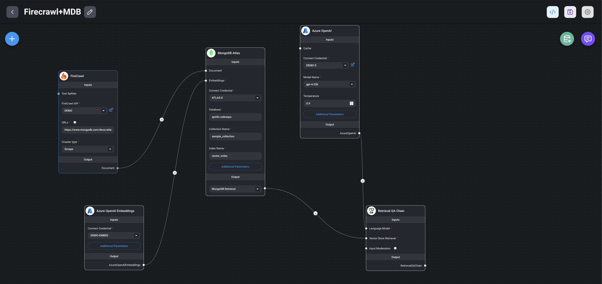

# flowise-mdb-firecrawl

## Why MongoDB Atlas for GenAI? 

**MongoDB Atlas** is more than just a database; it's a comprehensive platform designed to handle the diverse data needs of AI applications. From **time-series data** to **complex aggregations**, Atlas provides the tools you need to efficiently manage and analyze your data.

MongoDB Atlas is a fully-managed cloud database service that provides a robust, flexible, and scalable data platform for building Generative AI (GenAI) applications. It offers a suite of advanced features designed to handle the unique data requirements of modern AI workloads, including diverse data types, real-time processing, and global distribution. With its document-based architecture, MongoDB Atlas enables efficient storage and retrieval of complex, nested data structures, making it an ideal choice for AI applications that need to process and analyze diverse data sources. Its distributed design ensures high availability, horizontal scaling, and geographic distribution, providing a resilient and scalable foundation for AI-driven innovation. Whether you're developing chat interfaces, AI agents, or sophisticated agentic systems, MongoDB Atlas provides a unified, easy-to-use platform that simplifies data management and accelerates AI application development.

Its distributed design ensures high availability, horizontal scaling, and geographic distribution, providing a resilient and scalable foundation for AI-driven innovation. Whether you're developing chat interfaces, AI agents, or sophisticated agentic systems, MongoDB Atlas provides a unified, easy-to-use platform that simplifies data management and accelerates AI application development.

**Key Features:**

* **Time-Series Data:** Easily store and query time-stamped data for real-time insights and historical analysis.
* **Aggregation Framework:** Perform complex data transformations and calculations to extract valuable information.
* **Queryable Encryption:** Ensure data security with end-to-end encryption and flexible query capabilities.
* **Scalability:** Seamlessly handle growing data volumes and increasing workloads.
* **Integration:** Connect to popular AI frameworks and tools for a streamlined workflow.

## Flowise AI: Build Powerful AI Apps with Ease

**Flowise AI** simplifies the complex process of building AI applications.  Forget about writing tons of code – Flowise provides a **drag-and-drop interface** that lets you visually connect pre-built modules to create powerful AI workflows.

**Key Features for Faster Development:**

* **Drag-and-Drop Interface:** Build workflows intuitively without writing code, perfect for both developers and non-programmers.
* **Pre-built Modules:** Access a wide range of AI components like text generation, image recognition, and data manipulation tools.
* **Scalable Workflows:** Seamlessly connect modules to create sophisticated AI applications that can grow with your needs.
* **Customizable Logic:** Integrate conditional branching and user input to create interactive and responsive AI experiences.
* **Deployment Options:**  Host your AI applications on Flowise's cloud infrastructure or export them for on-premise deployment.

By leveraging Flowise AI's intuitive tools and powerful capabilities, you can focus on the creative aspects of AI development and bring your innovative ideas to life quickly. 

## Firecrawl: Effortless Web Scraping for AI

**Firecrawl** streamlines the data acquisition process for your AI projects.  Extract valuable information from websites with ease, empowering your AI models with the data they need to thrive.

**Key Features for AI-Ready Data:**

* **Powerful Scraping:**  Firecrawl tackles complex websites with ease, handling dynamic content, pagination, and various data formats.
* **Structured Output:**  Scraped data is automatically organized into clean, structured formats, ready for immediate use in your AI pipelines.
* **Scalable Workflows:**  Schedule automated scraping tasks to continuously gather fresh data and keep your AI models up-to-date.
* **Cloud-Based Integration:**  Firecrawl seamlessly integrates with popular cloud platforms and data storage solutions for effortless workflow management.
* **API Access:**  For maximum flexibility, leverage Firecrawl's API to automate data extraction directly within your AI development environment.

By leveraging Firecrawl's robust scraping capabilities, you can ensure your AI models have a steady stream of high-quality data, fueling their learning and performance. 

## Lets get started!

1. Lets download `Firecrawl+MDB Chatflow.json`
2. We open up the Flowise UI
3. Upload `Firecrawl+MDB Chatflow.json` as a Chatflow
4. Configure each node in the Chatflow as desired
5. Upsert Data from Firecrawl into MongoDB
6. Interact with the Chatflow

## Upload as a Chatflow

## Configure each node in the Chatflow

## Upsert to MongoDB

## Interact with the Chatflow

